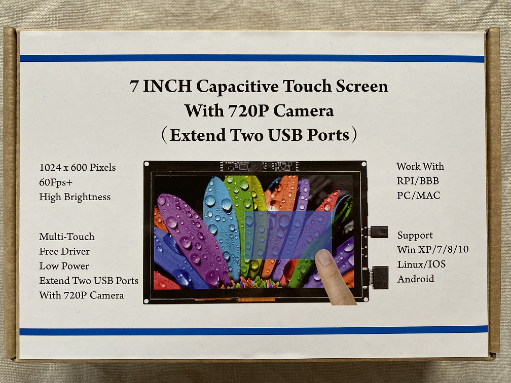

# 7inch-Display-Backlight-Mod
 Modification for 7inch 1024x600 capacitive touch screen to disable backlight during standby.

## Info
Many displays for Raspberry Pi / Beaglebone have missing connections between the HDMI controller and the backlight driver / MOSFET. Below is a modification for this [7-Inch-1024x600 Capacitive Touch Screen](https://wiki.52pi.com/index.php/7-Inch-1024x600_Capacitive_Touch_Screen_(Extend_Two_USB_HOST_Port)_with_720P_Camera_SKU:_EP-0087) particular display ([Pollin.de datasheet](https://www.pollin.de/productdownloads/D810843D.PDF)). Many displays are quite similar. Most of them feature a [Texas Instruments TFP401APZP DigitalReceiver](https://www.ti.com/lit/gpn/tfp401).\
The backlight of many displays stays on, even if the Raspberry Pi screensaver is active and HDMI link is down. This is because the related connections are missing. Some vendors solve this problem with a switch that needs to be slided manually.\
By adding the connection manually the backlight will be off if HDMI link is down. **Touch screen functionality remains with this modification. Screen will wake up on touching and backlight will light up again.**

## Requirements

- multimeter for measuring resistance.
- very sharp knife / scalpel
- Very thin wire. AWG 30 size is perfect
- solder iron with narrow tip

## Procedure

### Step 1

Locate HDMI controller (red) and backlight driver (yellow).

### Step 2

As you can see on the image below, Pin **#8** and **#9** is not connected and has no PCB trace. According to the [datasheet](https://www.ti.com/lit/gpn/tfp401) the pins have the following functionality:

- **Pin #8**: SCDT (Sync Detect) - Output signal for link active (high) and inactive (low). Can be tied externally to PDO.
- **Pin #9**: PDO (Output Power Drive Down) - Input signal to control the power-down state of output drivers. Normal operation (high), Output-drive power down (low)

We can solder both pins together to reduce power consumption during standby.

### Step 3

Fortunately both pins are side-by-side so it is easier to solder a tiny (AWG 30 size) wire to them. 

### Step 4

The input of the backlight driver / MOSFET is directly connected to 5V. The backlight will stay on whenever 5V is connected. Unfortunatly the connection to 5V is very near to the pin. In the yellow area you can see the driver pin on the left side and the connection to the frontside of the PCB on the right side.\
You will now have to **carefully cut** across the PCB trace (small red line). **Be 100% sure that you only cut this single connection and don´t let the knife slip!** See image in full-size.\
After you cut the trace **make sure that it is no longer connected to 5V**. Search for the 5V pin on one of the micro-usb ports and measure the resistance. Make also sure that no small metallic particles restore a connection between 5V and the input pin.

### Step 5

Now we have to connect to previosly soldered wire from the HDMI controller to the input pin of the backlight. Again measure the resistance between this pin and 5V. There should be no connection.

### Final

Your final result should look like the picture below. Some tape will secure the thin wire connection against ripping of.\
If the Raspberry /Beaglebone or any other HDMI device will go to screensaver the display will shut-down completely. The touch screen functionality stays active during power down. 

